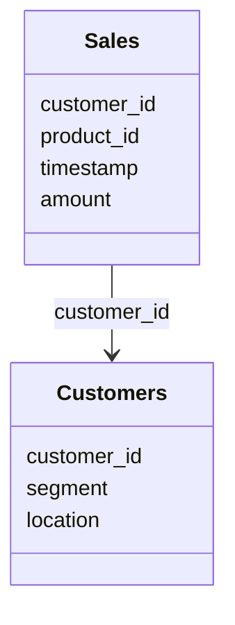

# Template: Data Simulation Specification

**Filename:** `16-data-simulation-specification.md`

```markdown
# Data Simulation Specification: [Company Name]

## 1. Simulation Context & Scope

This document specifies the rules, schemas, math models, and inflection points required to generate synthetic data for [Company Name]. The objective is to build a dataset that reflects the reality of the business model and contains detectable signals for the registered business problems.

## 2. Date Range & Frequency Configurations

The dataset is configured across three decision horizons:

| Data Entity (DA-) | Source System | Date Range (Start → End) | Record Frequency | Target Row Count |
| :--- | :--- | :--- | :--- | :--- |
| <!-- e.g. DA-SALES-01 --> | <!-- e.g. POS --> | 2023-06-01 → 2026-06-08 | Transactional (Hourly) | 5,000 |
| | | | | |

## 3. Relational Schema & Key Mapping

The generated entities join on the following keys:



## 4. Problem Nuance & Inflection Map

The table below maps how the 6 registered business problems are baked into the data across the Operational, Analytical, and Strategic layers:

| Problem ID | Problem Title | Affected Tables | Operational Layer (Spikes/Limits) | Analytical Layer (Correlations) | Strategic Layer (Trends/Breaks) |
| :--- | :--- | :--- | :--- | :--- | :--- |
| **UC-CAN-01**| <!-- Title --> | <!-- Tables --> | <!-- Operational Spec --> | <!-- Analytical Spec --> | <!-- Strategic Spec --> |
| **UC-CAN-02**| | | | | |
| **UC-CAN-03**| | | | | |
| **UC-CAN-04**| | | | | |
| **UC-CAN-05**| | | | | |
| **UC-CAN-06**| | | | | |

---

## 5. Detailed Problem Specifications

<!-- Repeat this block for each of the 6 problems -->

### [UC-CAN-0x]: [Problem Title]

*   **Story Narrative Link**: [NR-xxxx] (e.g. `NR-DIAG-01`)
*   **Target Inflection Timestamp(s)**: `YYYY-MM-DD` through `YYYY-MM-DD`
*   **Layer-by-Layer Nuance Specification**:
    *   **Operational**: <!-- specific out-of-bounds alarm limits, daily transaction spikes -->
    *   **Analytical**: <!-- variables to correlate, target coefficient, regression shifts -->
    *   **Strategic**: <!-- long-term baseline drift, step function adjustments, yearly impact -->
*   **Mathematical Simulation Formula**:
    $$Y_t = \text{Base} + T_t + S_t + \text{Inflection}_t + \epsilon_t$$
    *   Where $\epsilon_t \sim N(0, \sigma^2)$
    *   Trend ($T_t$): <!-- formula -->
    *   Seasonality ($S_t$): <!-- formula -->
    *   Inflection ($\text{Inflection}_t$): <!-- formula -->
*   **Generator Implementation Rules**:
    1.  <!-- specific rule for python generator (e.g. seed, distributions, bounds) -->
    2.  <!-- specific rule for handling dependencies on other tables -->

---

## 6. Traceability Matrix

| Problem ID (UC-) | Data Source (DA-) | Simulated Variable | KPI Supported (KPI-) | Analytics Engine (ENG-) |
| :--- | :--- | :--- | :--- | :--- |
| **UC-CAN-01** | DA-ERP-01 | `actual_cost` | KPI-OPS-01 | ENG-HW-01 |
| | | | | |

```
