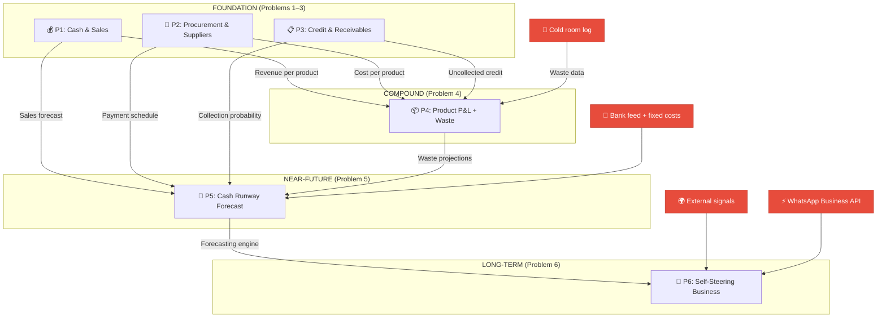

# Worked Example: Farmborg Foods

**Company**: Farmborg Foods (RC: 1655025)
**Industry**: Fresh Organic Food Retail, Wholesale & Perishable Logistics
**Location**: 114 Oyo Road, Orogun, Ajibode Junction, Ibadan, Nigeria
**Scale**: 1 storefront + cold storage depot, local delivery fleet, 10–15 employees
**Operating Model**: Multi-channel fresh food retail, bulk wholesaling, Ice Block sales, and home/business delivery
**Revenue Mix**: 40% Retail Walk-In/Social Media, 40% Bulk/Wholesale, 10% Delivery Fees, 10% Ice Blocks
**Data Sources**: POS database, website orders (farmborgfoods.com), Excel/Google Sheets (inventory, delivery logs), WhatsApp order tracking
**Target Stack**: DuckDB (Warehouse), dbt Core (Transformation), Prefab UI (Dashboards)

---

## Initial Problem Critique (Adoption Maximizer Applied)

Before generating the final problems, the following "obvious" problems were proposed and evaluated:

| # | Obvious Problem | Data Readiness | Daily Pull | Time to Dashboard | Verdict |
|---|-----------------|----------------|------------|-------------------|---------|
| 1 | Perishable Spoilage & Stockouts | 🔴 Requires temperature sensors, IoT on cold rooms, expiry-date databases | 🟡 Medium — spoilage checks are periodic | 🔴 Weeks to months | **REJECTED** — data infrastructure gap kills adoption |
| 2 | Last-Mile Delivery SLA Breaches | 🔴 Requires GPS fleet tracking, rider apps, dispatch timestamps | 🟡 Medium — requires tracking app first | 🔴 Weeks to months | **REJECTED** — assumes infrastructure that doesn't exist |
| 3 | Wholesale vs. Retail Margin Leakage | 🟢 Sales receipts exist in some form | 🟡 Medium — daily revenue is good, but LTV/CAC framing is analytical | 🟡 1–2 weeks | **PARTIALLY VIABLE** — operational core is good, analytical framing premature |

**Conclusion**: All 3 "obvious" problems require significant data infrastructure investment before any dashboard can go live. Replace with problems that work with data the business already generates.

---

## Tier 1–3: Foundation Problems

### Problem 1: Daily Cash & Sales Reconciliation

**Tier**: Foundation | **Primary Layer**: Operational

**Operational Component**: Real-time/daily sales totals by product, cash variance detection (expected vs. actual cash in drawer), payment method breakdown (cash/POS/bank transfer).

**Analytical Component**: Sales pattern analysis — day-of-week trends, seasonal demand patterns, customer segment contribution trends.

**Strategic Component**: Revenue growth trajectory, market share estimation, channel mix optimization.

**Simulated Data Markers**:
| Field Name | Data Type | Description |
|------------|-----------|-------------|
| `transaction_id` | Text | Unique sale identifier |
| `transaction_date` | Date | Date of sale |
| `product_category` | Text | Product type (chicken, goat, vegetables, ice blocks) |
| `item_qty` | Float | Quantity sold |
| `unit_price_ngn` | Float | Selling price per unit |
| `total_amount_ngn` | Float | Total transaction value |
| `payment_method` | Text | cash / POS / bank_transfer |
| `expected_cash_total` | Float | System-calculated expected cash |
| `actual_cash_deposited` | Float | Physically counted cash |
| `variance_ngn` | Float | Discrepancy amount |

**BI Adoption Value**: The owner/store manager already does this every evening — manually counting cash, cross-checking against receipts. If the dashboard does it automatically, they will open it every day without being asked.

**"Aha!" Moment**: *"We lose ₦12,000–₦18,000 per week in unreconciled cash — that's ₦800,000/year walking out the door."*

**Additional Investment**: None — uses existing POS receipts and bank transfer alerts.

---

### Problem 2: Procurement Cost Tracking & Supplier Scorecard

**Tier**: Foundation | **Primary Layer**: Operational (data capture) + Analytical (scorecard)

**Operational Component**: Daily purchase logging — what was bought, from whom, at what price, and whether it arrived on time.

**Analytical Component**: Supplier comparison matrix — price trends per product per supplier, reliability scoring, cost volatility analysis.

**Strategic Component**: Supply chain optimization, vendor consolidation decisions, bulk purchasing agreements.

**Simulated Data Markers**:
| Field Name | Data Type | Description |
|------------|-----------|-------------|
| `purchase_id` | Text | Unique purchase identifier |
| `purchase_date` | Date | Date of purchase |
| `supplier_name` | Text | Supplier identity |
| `product_category` | Text | Product type purchased |
| `unit_cost_ngn` | Float | Cost per unit from this supplier |
| `qty_purchased` | Float | Quantity purchased |
| `total_cost_ngn` | Float | Total purchase cost |
| `quality_rating` | Integer (1-5) | Subjective quality assessment |
| `delivery_on_time_flag` | Boolean | Whether delivery met expected timeline |

**BI Adoption Value**: Fresh food prices fluctuate daily in Nigerian markets. The buyer currently relies on memory and relationships. A price-tracking dashboard showing cost trends per product per supplier would be opened every morning before the buyer goes to market.

**"Aha!" Moment**: *"Supplier A charges ₦200/kg more for cow meat on average, but Supplier B delivers late 40% of the time — so we're paying a hidden premium either way."*

**Additional Investment**: None — uses existing purchase receipts and supplier invoices.

---

### Problem 3: Customer Credit & Receivables Aging

**Tier**: Foundation | **Primary Layer**: Operational (status tracking) + Analytical (risk analysis)

**Operational Component**: Current outstanding balances per customer, aging bracket distribution (0–15, 16–30, 31–60, 60+ days), payment reminder triggers.

**Analytical Component**: Payment behaviour pattern analysis, customer reliability segmentation, credit risk scoring based on historical payment speed.

**Strategic Component**: Credit policy design, customer portfolio optimization, bad-debt provisioning.

**Simulated Data Markers**:
| Field Name | Data Type | Description |
|------------|-----------|-------------|
| `invoice_id` | Text | Unique invoice identifier |
| `customer_name` | Text | Customer identity |
| `customer_segment` | Text | retail / bulk |
| `invoice_amount_ngn` | Float | Total invoiced amount |
| `amount_paid_ngn` | Float | Amount received so far |
| `balance_outstanding_ngn` | Float | Remaining unpaid balance |
| `invoice_date` | Date | Date goods were delivered/sold |
| `days_outstanding` | Integer | Days since invoice |
| `payment_status` | Text | paid / partial / overdue |

**BI Adoption Value**: In Nigerian food wholesale, credit sales are extremely common. Tracking who owes what is currently done in a physical notebook or the owner's memory. Outstanding debts are a massive cash flow drain, and the pain of chasing payments is felt weekly.

**"Aha!" Moment**: *"We have ₦1.2M in receivables older than 30 days across 8 bulk customers — that's our entire monthly rent and salaries sitting in other people's pockets."*

**Additional Investment**: None — uses existing sales ledger and payment records.

---

### Daily Operating Rhythm Created by Problems 1–3

| Time | Action | Problem |
|------|--------|---------|
| **Morning** | Check procurement prices and supplier scorecard before going to market | Problem 2 |
| **Evening** | Reconcile cash and review today's sales | Problem 1 |
| **Weekly** | Review receivables aging and chase overdue payments | Problem 3 |

---

## Tier 4: Compound Value Problem

### Problem 4: Product-Level Profit & Loss with Waste Visibility

**Tier**: Compound Value | **Primary Layer**: Analytical

**Data streams consumed from prior problems**:
- Revenue per product per day (from Problem 1)
- Cost per product per supplier per day (from Problem 2)
- Uncollected credit per customer (from Problem 3)

**The gap**: Bought 60kg chicken. Sold 40kg. Where did the other 20kg go? The physical flow of goods between procurement and sale is invisible.

**The single new data capture point**: A cold room stock log — a tablet or phone where staff log stock-in (received), stock-out (sold), and stock-out (waste/disposed). Links to existing procurement and sales pipelines.

**Operational Component**: Daily waste logging at cold room (stock-in/stock-out records).

**Analytical Component**: True margin calculation connecting revenue (P1) minus cost (P2) minus uncollected credit (P3) minus spoilage (new). Product profitability ranking. Waste rate diagnostics by category.

**Strategic Component**: Product portfolio optimization — discontinue loss-making lines, invest in high-margin categories.

**Simulated Data Markers**:
| Field Name | Data Type | Description |
|------------|-----------|-------------|
| `stock_log_id` | Text | Unique log entry |
| `product_category` | Text | Product type |
| `log_type` | Text | stock_in / stock_out_sale / stock_out_waste |
| `quantity_kg` | Float | Quantity moved |
| `log_timestamp` | Timestamp | When the movement occurred |
| `batch_age_days` | Integer | Days since this batch was procured |
| `waste_reason` | Text | spoiled / expired / damaged / other |

**BI Adoption Value**: The owner discovers which products are truly profitable after all hidden costs are accounted for.

**"Aha!" Moment**:

| Product | Revenue | Cost | Unpaid Credit | Spoilage | **True Margin** | **Margin %** |
|---------|---------|------|---------------|----------|-----------------|-------------|
| Whole Chicken | ₦480,000 | ₦312,000 | ₦45,000 | ₦72,000 | **₦51,000** | **10.6%** |
| Goat Meat | ₦290,000 | ₦168,000 | ₦8,000 | ₦12,000 | **₦102,000** | **35.2%** |
| Vegetables | ₦85,000 | ₦38,000 | ₦0 | ₦28,000 | **₦19,000** | **22.4%** |
| Ice Blocks | ₦120,000 | ₦42,000 | ₦0 | ₦0 | **₦78,000** | **65.0%** |

*"I thought chicken was my best product because it generates the most revenue. But after spoilage and unpaid credit, I keep only ₦51K on ₦480K. Goat meat makes me ₦102K on less than half the revenue — and ice blocks are my most profitable line at 65% margin with zero waste."*

**What's needed vs. what's already built**:

| Requirement | Already Built? |
|-------------|---------------|
| Product-level sales pipeline | ✅ From Problem 1 |
| Product-level cost pipeline | ✅ From Problem 2 |
| Customer payment status | ✅ From Problem 3 |
| DuckDB + dbt + Prefab UI | ✅ Operational infrastructure |
| Team dashboard habit | ✅ Daily rhythm from P1–P3 |
| **Cold room stock log** | ❌ **One tablet + one simple form** |

**Additional Investment**: One Android tablet (₦30,000–₦50,000) or staff phone with a simple logging app/Google Form.

---

## Tier 5: Near-Future Problem

### Problem 5: Predictive Cash Runway & Intelligent Daily Briefing

**Tier**: Near-Future | **Primary Layer**: Strategic

**Data streams consumed from all prior problems**:
- Revenue patterns and forecasts (Problem 1 data)
- Supplier payment obligations (Problem 2 data)
- Expected collections and probability (Problem 3 data)
- Inventory burn rate and restock needs (Problem 4 data)

**Operational Component**: Daily bank balance capture, fixed cost schedule entry.

**Analytical Component**: Cash flow pattern modelling, collection probability scoring based on historical payment behavior.

**Strategic Component**: 14-day rolling cash runway projection, "what-if" scenario simulation, prescriptive daily actions, composite business health score.

**Simulated Data Markers**:
| Field Name | Data Type | Description |
|------------|-----------|-------------|
| `forecast_date` | Date | Projected date |
| `projected_revenue_ngn` | Float | Expected revenue based on historical patterns |
| `projected_costs_ngn` | Float | Expected outflows (supplier payments, fixed costs) |
| `projected_collections_ngn` | Float | Expected receivables collected |
| `projected_balance_ngn` | Float | Forecasted bank balance |
| `runway_status` | Text | safe / watch / action / danger |
| `health_score` | Integer (0-100) | Composite business health |

**BI Adoption Value**: Solves the owner's deepest daily anxiety: "Will I have enough cash next week to pay suppliers and salaries?"

**Prescriptive actions (each referencing prior problems)**:
1. "Collect ₦180K from Mama Tolu — 45 days overdue, historically pays within 3 days of reminder" *(Problem 3 data)*
2. "Reduce Thursday procurement by 30% — last 4 Thursdays show lower sales" *(Problem 1 data)*
3. "Switch to Supplier C for goat meat — ₦150/kg cheaper this week" *(Problem 2 data)*
4. "Discount 8kg of aging chicken — sell at 15% off vs. ₦19K spoilage loss" *(Problem 4 data)*

**Delivery mechanism**: WhatsApp morning briefing at 7:00 AM:
```
🌅 Good morning, Farmborg!

📊 Yesterday: Revenue ₦127K | Margin ₦41K (32%)
💰 Bank Balance: ₦482,000
⚠️ Runway: 9 days (drops to ₦62K by Tuesday)

🎯 Today's Top 3 Actions
1. Collect ₦180K from Mama Tolu (overdue 45 days)
2. Buy 40kg chicken, NOT 55kg (mid-week demand lower)
3. Supplier B has goat at ₦2,100/kg — ₦300 cheaper than A

💯 Health Score: 71 / 100 (↓3 from last week)
```

**Business Health Score formula**:
- Cash Position (runway days): 35% weight
- Receivables Health (% current): 25% weight
- Inventory Freshness (% within shelf life): 20% weight
- Margin Trend (7-day moving average): 20% weight

**Additional Investment**: Bank balance data feed (daily CSV or manual entry), fixed cost schedule (one-time entry).

---

## Tier 6: Long-Term Vision Problem

### Problem 6: The Self-Steering Business — External Intelligence & Autonomous Operations

**Tier**: Long-Term Vision | **Primary Layer**: Strategic

**External Signals Integrated**:

| External Signal | Source | What It Tells the System | Impact |
|-----------------|--------|--------------------------|--------|
| Weather forecast | OpenWeatherMap API (free) | Rain → foot traffic drops 30-40% | Auto-reduce procurement |
| Religious/cultural calendar | Pre-loaded calendar data | Eid/Christmas → demand spikes 200-300% | Advance supplier orders |
| University calendar | Manual entry | Semester start → student influx | Stock affordable proteins |
| Market price intelligence | WhatsApp supplier broadcasts | Market price changes | Flag overcharging suppliers |
| Power grid status | Local knowledge / IoT sensor | Extended outage → cold chain risk | Accelerate at-risk stock sales |

**Tier 1 Autonomous Actions (Low Stakes — System Acts)**:
- Freshness-based dynamic pricing pushed to WhatsApp catalog
- Automated reorder messages to preferred suppliers via WhatsApp Business API
- Customer credit limit enforcement based on calculated risk thresholds

**Tier 2 Human-Approved Actions (High Stakes — Owner Approves via WhatsApp)**:
- Seasonal demand surge procurement plans (e.g., Eid preparation)
- Supplier switching recommendations when scorecard drops
- Cash crisis intervention recovery plans

**Learning Loop**:
- Sense (external signals + internal data) → Predict (demand + cash model) → Decide (autonomous or approval) → Act (place order, adjust price) → Measure (was prediction accurate?) → Feed back into model

**Side-by-Side Demo Scenario: "Unexpected Heavy Rain on Tuesday"**:

| Without Problem 6 | With Problem 6 |
|--------------------|----------------|
| Owner checks weather app, thinks "maybe fewer customers" | System detects 85% rain probability, cross-references historical data (rain Tuesdays = -38% traffic) |
| Buyer goes to market, buys normal quantities | System auto-reduces procurement by 35%, sends adjusted order to Supplier B |
| 15kg chicken unsold → spoils by Thursday | System pushes "Rainy Day Special: 10% off" to WhatsApp catalog |
| 3 delivery orders cancelled → riders idle | System reschedules non-urgent deliveries to Wednesday |
| **₦40,000 lost** (waste + idle riders) | **₦7,200 waste only** — owner didn't even have to think about it |

**Additional Investments**:

| Investment | Estimated Cost | Timeline |
|------------|---------------|----------|
| Weather API integration | Free (OpenWeatherMap) | Month 6–9 |
| WhatsApp Business API | ₦15K–₦30K/month | Month 9–12 |
| ML forecasting model upgrade | Developer time | Month 12–18 |
| IoT cold room sensor (optional) | ₦25K–₦40K one-time | Month 12–18 |
| Calendar event database | Free (one-time entry) | Month 6 |

---

## Output 2: Cumulative Data Infrastructure Map



### Data Assets Created Per Problem

| Problem | New Data Assets Created | New Data Capture Required |
|---------|------------------------|---------------------------|
| P1 | Daily transaction log, payment method split, cash variance | POS receipt digitization |
| P2 | Purchase cost log, supplier delivery records | Purchase receipt logging |
| P3 | Customer ledger, aging brackets, payment history | Sales ledger digitization |
| P4 | Inventory lifecycle log, waste records, batch age tracking | Cold room stock log (1 tablet) |
| P5 | Cash flow model, forecast dataset, health score | Bank balance feed, fixed cost schedule |
| P6 | External signal feeds, autonomous decision log, model accuracy log | Weather API, WhatsApp Business API, calendar DB |

---

## Output 3: Layer Decomposition

### Build 1: Operational — "The Daily Heartbeat"

| Problem Assignment | Component Description | Operational KPIs Created |
|--------------------|----------------------|--------------------------|
| P1 (full) | Daily sales totals, cash reconciliation, payment methods | KPI-OP-01: Daily Revenue by Product, KPI-OP-02: Cash Variance, KPI-OP-03: Payment Method Split |
| P2-OP | Daily purchase logging, supplier delivery tracking | KPI-OP-04: Daily Procurement Cost, KPI-OP-05: Supplier On-Time Rate |
| P3-OP | Outstanding balances, aging brackets, payment alerts | KPI-OP-06: Total Outstanding Receivables, KPI-OP-07: Aging Bracket Distribution |

**Primary Users**: Store Manager, Procurement Buyer, Business Owner
**Cadence**: Daily

---

### Build 2: Analytical — "The Diagnostic Engine"

| Problem Assignment | Component Description | Analytical KPIs Created | Cross-Horizon References |
|--------------------|----------------------|-------------------------|--------------------------|
| P2-ANA | Supplier comparison matrix, price trend diagnostics | KPI-ANA-01: Supplier Price Variance, KPI-ANA-02: Supplier Reliability Score | References KPI-OP-04, KPI-OP-05 |
| P3-ANA | Payment behaviour patterns, credit risk scoring | KPI-ANA-03: Customer Credit Risk Score, KPI-ANA-04: Payment Probability by Cohort | References KPI-OP-06, KPI-OP-07 |
| P4 (full) | True margin calculation, waste diagnostics, product profitability | KPI-ANA-05: True Product Gross Margin, KPI-ANA-06: Waste Rate by Category, KPI-ANA-07: Cost of Waste | References KPI-OP-01, KPI-OP-04, KPI-OP-06 |

**Primary Users**: Business Owner, Procurement Buyer
**Cadence**: Weekly diagnostic reviews + ad-hoc investigation

---

### Build 3: Strategic — "The Forward-Looking Intelligence"

| Problem Assignment | Component Description | Strategic KPIs Created | Cross-Horizon References |
|--------------------|----------------------|------------------------|--------------------------|
| P5 (full) | Cash runway forecast, scenario simulation, WhatsApp briefing | KPI-STR-01: Cash Runway Days, KPI-STR-02: Forecast Accuracy, KPI-STR-03: Business Health Score | References all Analytical KPIs + bank feed |
| P6 (full) | External intelligence, autonomous operations, learning loop | KPI-STR-04: Demand Forecast Accuracy, KPI-STR-05: Autonomous Decision Success Rate, KPI-STR-06: External Signal Response Time | References all prior KPIs + external APIs |

**Primary Users**: Business Owner (governor role)
**Cadence**: Continuous (automated) + weekly strategic review

---

## Output 4: Analytics Maturity Staircase

| # | Problem | Analytics Type | Owner's Role | Time Orientation | Layer |
|---|---------|---------------|--------------|------------------|-------|
| 1 | Cash & Sales Reconciliation | Descriptive | Reads dashboard | Past | Operational |
| 2 | Procurement & Supplier Scorecard | Comparative | Reads + compares | Past | Operational + Analytical |
| 3 | Customer Credit & Receivables | Diagnostic (light) | Decides + acts | Present | Operational + Analytical |
| 4 | Product P&L + Waste Visibility | Diagnostic (deep) | Discovers insights | Present | Analytical |
| 5 | Cash Runway Forecast + Briefing | Predictive + Prescriptive | Reviews + approves | Future (14 days) | Strategic |
| 6 | Self-Steering Business | Autonomous + Adaptive | Oversees + overrides | Future (continuous) | Strategic |
